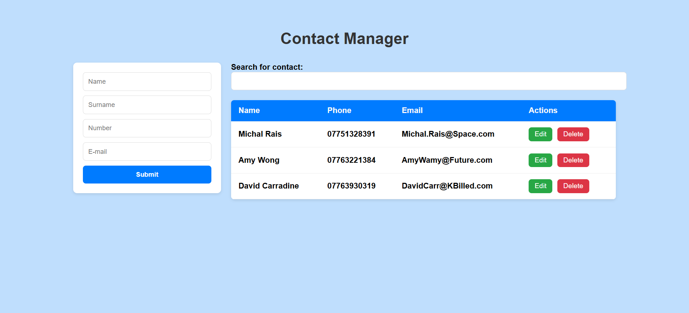

# Contact Manager App

A simple React-based contact manager application for practicing component structure, state management, and CRUD operations.

Project is focused on code only. Styles and layout are inspired by: 
https://medium.com/@francesco.saviano87/build-a-simple-contact-manager-with-js-741792d2904f

## Features
- Add, edit, and delete contacts
- Search contacts by name, phone, or email
- Persistent storage with `localStorage`
- Split into reusable components (Form, Search, List)

## Screenshots
