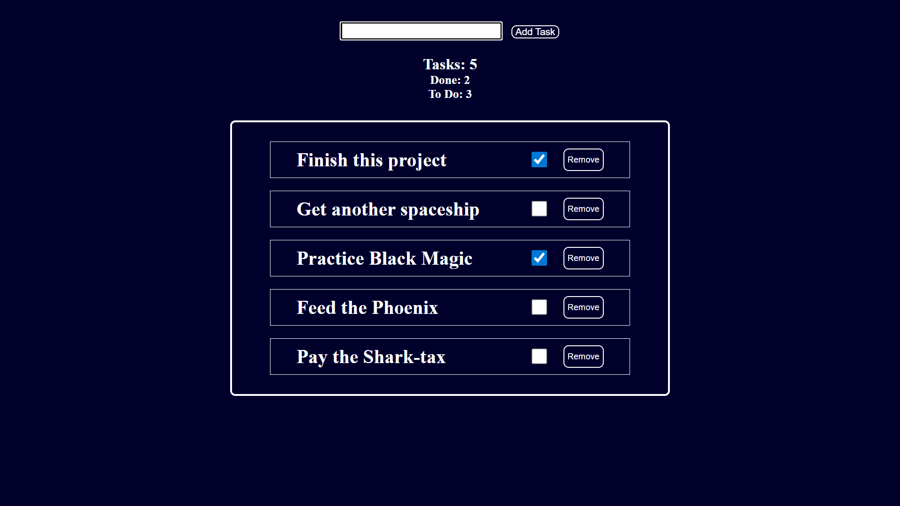

# React To-Do App

A simple to-do list built with React for daily practice.  
Features include:  
- Add new tasks  
- Mark tasks as done/undone  
- Remove tasks  
- Task counters (total, done, undone)  
- LocalStorage persistence  

## Purpose
Practice React basics: components, state, props, event handling, conditional rendering, and local storage.

## Usage
1. Type a task and press **Enter** or click **Submit**.  
2. Toggle the checkbox to mark as done.  
3. Remove tasks with the delete button.  
4. Tasks are saved automatically in your browser.

## Screenshots
