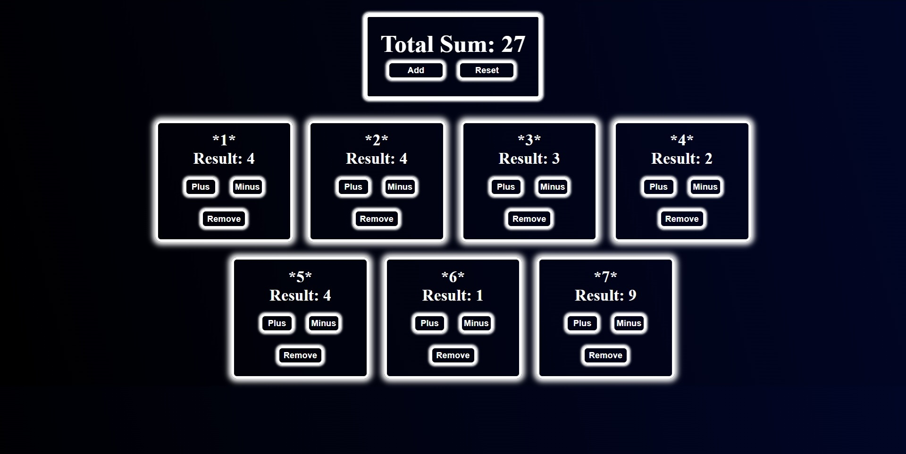

# Counters App 🧮

A small React project built for daily practice.  
It allows you to create multiple counters, increase or decrease their values, remove them, and reset everything at once.  
The app also calculates the **total sum** across all counters.

---

## Features 🚀
- Add new counters dynamically  
- Increase / decrease each counter independently  
- Remove counters  
- Reset all counters  
- Total sum displayed and updated in real-time  
- Clean and responsive UI with simple styling  

---

## Screenshots 📸
### Main View

---

## Tech Stack ⚛️
- React (useState, useEffect hooks)  
- CSS for styling  

---