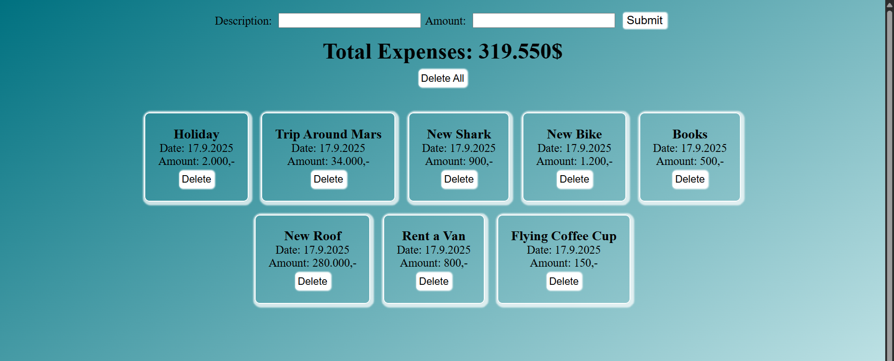

# Expense Tracker  

A simple React app to track daily expenses.  
Users can add a description and amount, view the total sum of expenses, and manage them with options to delete one or clear all.  
All data is saved in **localStorage**, so it persists across page reloads.  

## Features  
- Add expense with description, amount, and date  
- View total expenses (auto-summed)  
- Delete a single expense  
- Delete all expenses  
- Persistent data with localStorage  
- Basic responsive styling  

## Tech Stack  
- React (useState, useEffect)  
- LocalStorage for persistence  
- CSS for styling  

## Screenshots

